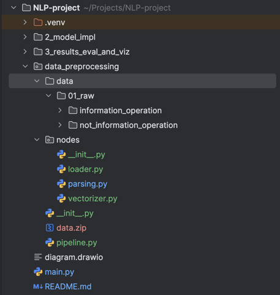

# NLP-project
To run project, firstly, download data from https://drive.google.com/file/d/1hI5put-vkDLPLbPe2VJvQPxTuN9QMQDg/view?usp=sharing.
Also, have project structure like this:
  
Then run main.py in project root:  
```python main.py```

